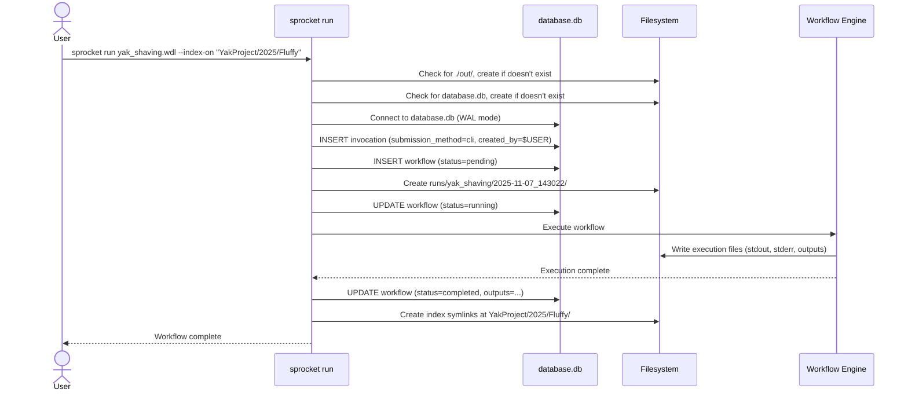
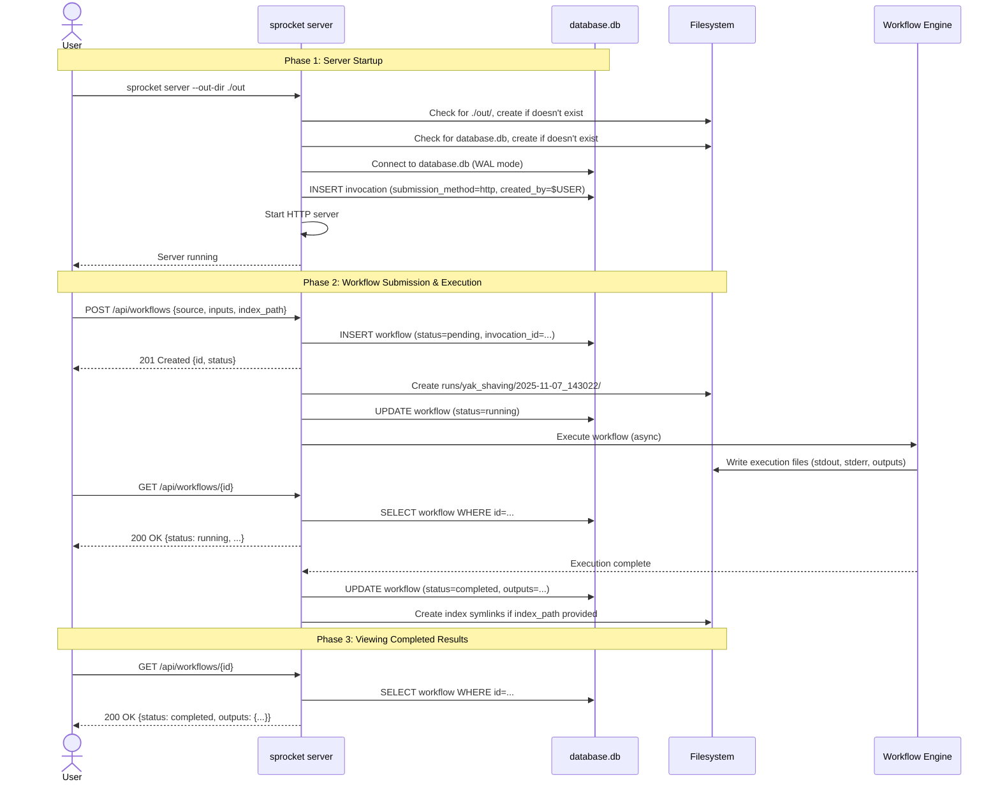

# Provenance Tracking and Analysis Management

## Table of Contents

- [Summary](#summary)
- [Motivation](#motivation)
- [Architecture Overview](#architecture-overview)
- [Database Schema](#database-schema)
  - [Metadata Table](#metadata-table)
  - [Invocations Table](#invocations-table)
  - [Workflows Table](#workflows-table)
  - [Index Log Table](#index-log-table)
  - [Foreign Key Constraints](#foreign-key-constraints)
  - [Concurrency](#concurrency)
- [Directory Structure](#directory-structure)
  - [Output Directory Layout](#output-directory-layout)
  - [Directory Behaviors](#directory-behaviors)
- [Index Functionality](#index-functionality)
  - [Index Creation](#index-creation)
  - [Symlinking Behavior](#symlinking-behavior)
- [CLI Workflow](#cli-workflow)
  - [Execution Flow](#execution-flow)
  - [CLI Flags](#cli-flags)
  - [Key Behaviors](#key-behaviors)
- [Server Mode](#server-mode)
  - [Server Configuration](#server-configuration)
  - [Execution Flow](#execution-flow-1)
  - [REST API Endpoints](#rest-api-endpoints)
- [Configuration](#configuration)
  - [Configuration File](#configuration-file)
- [Rationale and Alternatives](#rationale-and-alternatives)
  - [Why SQLite?](#why-sqlite)
  - [Alternative: PostgreSQL](#alternative-postgresql)
  - [Alternative: Embedded Key-Value Stores (RocksDB, LMDB)](#alternative-embedded-key-value-stores-rocksdb-lmdb)
  - [Alternative: Filesystem Only (No Database)](#alternative-filesystem-only-no-database)

## Summary

This RFC proposes a comprehensive provenance tracking and analysis management system for Sprocket built on the principle of progressive disclosure. The system automatically tracks all workflow executions in a SQLite database while maintaining a dual filesystem organization: a complete provenance record preserving every execution detail in chronological directories (`runs/`), and an optional user-defined logical index (`index/`) that symlinks outputs into domain-specific hierarchies (e.g., by project or analysis type). This approach scales from simple single-workflow use cases to production analysis management systems handling thousands of samples, providing both the auditability of complete execution history and the usability of custom organization without requiring users to choose one or maintain both manually.

## Motivation

Sprocket currently focuses on executing workflows and producing outputs, but several critical aspects of production bioinformatics work remain unaddressed. The current output directory structure, organized solely by workflow name and timestamp, makes it difficult for users to find their results, particularly when managing multiple projects. While a complete provenance filesystem organized by execution time provides valuable auditability—preserving every execution detail, retry attempt, and task output in a structured hierarchy—this very completeness creates organizational complexity. Outputs are scattered across timestamped directories deep within nested task execution paths, with no logical organization by project or data type. Users need both the complete provenance record for reproducibility and a simplified, domain-specific view for everyday access. Currently, they must choose one or the other, or maintain both manually through external scripts. There is also no way to track all workflows run against a given sample or understand analysis lineage over time.

Additionally, Sprocket maintains no persistent record of execution history. Users cannot query which workflows were run, when they executed, what inputs were provided, or who submitted them. This lack of provenance tracking makes it impossible to audit past analyses or understand the evolution of results. Furthermore, there is no real-time visibility into running workflows across multiple submissions, making it difficult to monitor the overall state of an analysis pipeline or identify bottlenecks.

Existing solutions in the broader ecosystem fall into two categories. Lightweight engines handle execution well but leave tracking and organization to external tools that users must discover, install, and configure separately. Enterprise analysis management systems provide comprehensive tracking but require significant infrastructure to deploy, creating a barrier to entry that prevents users from simply trying them out.

This RFC proposes a middle path through [**progressive disclosure**](https://en.wikipedia.org/wiki/Progressive_disclosure): Sprocket provides sophisticated analysis management capabilities that activate automatically as users need them, without requiring upfront infrastructure or configuration.

### User Journey

A user learns about Sprocket and wants to try a yak shaving workflow. They have a yak named Fluffy who desperately needs a haircut, so they download Sprocket and run:

```bash
sprocket run yak_shaving.wdl -i defaults.json yak_name=fluffy style=mohawk
```

A directory called `out/` is created automatically in their current working directory. Within it, they find their workflow outputs organized in `out/runs/yak_shaving/<timestamp>/`, where the timestamp corresponds to when they ran the workflow. A database at `out/database.db` silently tracks the execution, but the user doesn't need to think about it. They have their results as returned in the output JSON. This is the Sprocket "light-disclosure" experience—working results with zero configuration.

The user finds this approach easy and begins to wonder if Sprocket can style all yaks in their herd. Beyond just performing the styling, the user hopes Sprocket can organize the yak satisfaction surveys for long-term safe keeping. 

Looking through the documentation, they discover the `--index-on` flag and adapt their workflow:

```bash
for YAK in yaks/*; do
  sprocket run yak_shaving.wdl -i defaults.json \
    yak_name=$YAK style=mohawk \
    --index-on "YakProject/2025/$YAK"
done
```

As these workflows complete, a new directory structure appears under `out/index/YakProject/2025/`, with each yak's photos and satisfaction surveys organized in subdirectories by yak name. The index contains symlinks pointing back to files in `out/runs/`, so the historical execution record remains intact while the index provides the logical organization the user cares about. If they rerun a yak's styling, the index automatically updates to point to the new results while the database's `index_log` table preserves the complete history of what was indexed at each point in time. The entire directory structure is portable—moving the `out/` directory with `mv` preserves all relationships. With just one additional flag, they've unlocked organized output management across their entire herd. This is the Sprocket "medium-disclosure" experience.

Now satisfied with their organized outputs, the user realizes they'd like real-time monitoring of running workflows and the ability to submit styling orders remotely from their laptop while execution happens on a shared server. They run:

```bash
sprocket server --port 8080
```

The HTTP server starts immediately, connecting to the existing database and making all historical runs queryable through a REST API. They can now submit workflows via HTTP and monitor progress through API queries. All workflows submitted through the API are tracked in the same database alongside CLI submissions, and all outputs appear in the same `out/` directory structure. There's no database setup, no configuration files to manage, no migration of historical data—they simply started the server and gained remote access and monitoring capabilities. This is the Sprocket "heavy-disclosure" experience.

This progression happens naturally as the user's needs grow, without requiring infrastructure changes or data migration. Each step builds on the previous one while the underlying output directory and database remain unchanged.

## Architecture Overview

The system consists of three independent but coordinated components sharing a common output directory and database.

* **CLI Execution Mode** (`sprocket run`). Direct workflow execution that initializes the output directory on first use, creates the database schema via migrations, executes workflows in-process, writes execution metadata transactionally to the database, and creates index symlinks when specified via `--index-on`.

* **Server Mode** (`sprocket server`). An HTTP API server that initializes the output directory on first use if needed, accepts workflow submissions via REST API, executes workflows using the same engine as CLI, provides query endpoints for run history and status, and shares the database with CLI via SQLite WAL mode for concurrency.

* **Output directory** (`./out/`). Filesystem-based storage containing `database.db` (a SQLite database tracking all executions), `runs/<workflow>/<timestamp>/` (execution directories organized by workflow and timestamp), and `index/` (optional symlinked organization created via `--index-on`).

All three components use identical database schema and filesystem conventions, enabling seamless interoperability. A workflow submitted via CLI is immediately visible to the server, and vice versa.

To ensure consistent workflow execution behavior between CLI and server modes, we'll refactor the current evaluation and execution code to use an actor-based architecture. A workflow manager actor will handle workflow lifecycle management, database updates, and index creation through message passing. The actor will spawn one or more Tokio tasks to execute workflows concurrently. For `sprocket run`, the actor will manage a single workflow execution task. For `sprocket server`, the same actor implementation will manage multiple concurrent workflow execution tasks, one per submitted workflow. This shared architecture ensures that workflow execution semantics, error handling, and database interactions remain identical regardless of submission method.

## Database Schema

The provenance database uses a simple schema optimized for common queries while keeping implementation straightforward. Each output directory is versioned to ensure compatibility between different Sprocket releases.

### Metadata Table

The `metadata` table tracks the output directory schema version:

```sql
create table if not exists metadata (
  -- Metadata key
  key text primary key,
  -- Metadata value
  value text not null
);

-- Insert schema version
insert into metadata (key, value) values ('schema_version', '1');
```

Sprocket checks the `schema_version` on startup and automatically migrates the database schema to the current version if needed. Migrations are applied atomically to ensure database consistency.

### Invocations Table

The `invocations` table groups related workflow submissions.

```sql
create table if not exists invocations (
  -- Unique invocation identifier (UUID v4)
  id text primary key,
  -- How workflows are submitted — `cli` or `http`
  submission_method text not null,
  -- User or client that created the invocation
  created_by text,
  -- When the invocation was created
  created_at timestamp not null
);
```

Each `sprocket run` command creates its own invocation with `created_by` populated from the `$USER` environment variable or system username. A running `sprocket server` instance creates a single invocation at startup that is shared by all workflows submitted to that server.

### Workflows Table

The `workflows` table tracks individual workflow executions.

```sql
create table if not exists workflows (
  -- Unique run identifier (UUID v4)
  id text primary key,
  -- A link to the invocation that created this workflow
  invocation_id text not null,
  -- Workflow name extracted from WDL document
  name text not null,
  -- Workflow source (file path, URL, or git reference)
  source text not null,
  -- Current execution status — `pending`, `running`, `completed`, or `failed`
  status text not null,
  -- JSON-serialized workflow inputs
  inputs text,
  -- JSON-serialized workflow outputs (`null` until completion)
  outputs text,
  -- Error message if status is `failed` (`null` otherwise)
  error text,
  -- Relative path to execution directory from `database.db` (e.g., `runs/workflow_name/2025-11-07_143022123456`)
  execution_dir text not null,
  -- When run record was created
  created_at timestamp not null,
  -- When execution started (`null` if still pending)
  started_at timestamp,
  -- When execution finished, success or failure (`null` if still running)
  completed_at timestamp,
  foreign key (invocation_id) references invocations(id)
);
```

### Index Log Table

The `index_log` table tracks the history of index symlink updates.

```sql
create table if not exists index_log (
  -- Unique log entry identifier (UUID v4)
  id text primary key,
  -- Path within the index directory (e.g., `YakProject/2025/Fluffy/final_photo.jpg`)
  index_path text not null,
  -- Target path relative to `database.db` that the symlink points to (e.g., `runs/yak_shaving/2025-11-07_143022123456/calls/trim_and_style/attempts/0/work/final_photo.jpg`)
  target_path text not null,
  -- Foreign key to `workflows.id` (which workflow created this symlink)
  workflow_id text not null,
  -- When this symlink was created or updated
  created_at timestamp not null,
  foreign key (workflow_id) references workflows(id)
);
```

Each time a workflow creates or updates a symlink in the index (via `--index-on`), a record is inserted into this table. For workflows that update an existing index path, both the old and new symlink targets are preserved in the log, enabling complete historical tracking. Users can query this table to determine what data was indexed at any point in time by finding the most recent log entry before a given date.

### Foreign Key Constraints

SQLite foreign key constraints are enabled via `pragma foreign_keys = on` at connection time. The `workflows.invocation_id` foreign key ensures referential integrity.

### Concurrency

SQLite operates in [WAL (Write-Ahead Logging) mode](https://www.sqlite.org/wal.html), which allows multiple concurrent readers, one writer at a time (writes are serialized), and readers to access the database during writes. This enables CLI and server to operate simultaneously on the same database without coordination. Database locks are held briefly (milliseconds per transaction), making contention unlikely for typical workflow submission rates. In the rare case of write conflicts, Sprocket will automatically retry the transaction with exponential backoff.

## Directory Structure

### Output Directory Layout

The output directory is the fundamental unit of organization containing all workflow executions, metadata, and indexes:

```
./out/
├─ database.db                        # SQLite provenance database
├─ database.db-shm                    # SQLite shared memory (WAL mode)
├─ database.db-wal                    # SQLite write-ahead log (WAL mode)
├─ runs/                              # Workflow execution directories
│  └─ <workflow_name>/                # Workflow-specific directory
│     ├─ <timestamp>/                 # Individual run (YYYY-MM-DD_HHMMSSffffff)
│     │  └─ calls/                    # Task execution directories
│     │     └─ <task_call_id>/        # Task identifier (e.g., "hello-0")
│     │        ├─ attempts/           # Retry attempts directory
│     │        │  └─ <attempt_number>/  # Attempt number (0, 1, 2, ...)
│     │        │     ├─ command       # Executed shell script
│     │        │     ├─ stdout        # Task standard output
│     │        │     ├─ stderr        # Task standard error
│     │        │     └─ work/         # Task working directory
│     │        │        └─ <output_files>  # Task-generated output files
│     │        └─ tmp/                # Temporary localization files
│     └─ _latest -> <timestamp>/      # Symlink to most recent run (Unix only)
└─ index/                             # Optional symlinked organization
   └─ <user_defined_path>/            # Created via --index-on flag
      └─ <symlinks_to_outputs>        # Symlinks to files in runs/
```

### Directory Behaviors

* On first `sprocket run` or `sprocket server` invocation, `./out/` is created if missing, `database.db` is initialized with schema migrations. If invoked via `sprocket run`, the `runs/<workflow_name>/<timestamp>/` directory structure is created for execution.
* Output directory location defaults to `./out/` relative to current working directory, configurable via `--out-dir` flag, `SPROCKET_OUTPUT_DIR` environment variable, or `~/.config/sprocket/Sprocket.toml`.
* The entire output directory is relocatable via `mv`. All paths stored in `database.db` are relative to the database file, enabling portability when the output directory is moved.

## Index Functionality

The index provides user-defined logical organization of outputs on top of the execution-oriented runs directory structure. On Windows, creating symlinks requires administrator privileges or [Developer Mode](https://blogs.windows.com/windowsdeveloper/2016/12/02/symlinks-windows-10/) (Windows 10 Insiders build 14972 or later). Windows 11 allows unprivileged symlink creation without Developer Mode. If Sprocket cannot create symlinks due to insufficient permissions, index creation will fail with an error instructing the user to run with administrator privileges or enable Developer Mode. Index symlinks are explicitly requested by the user via `--index-on` and their failure prevents the expected organization from being created. The `_latest` symlink (pointing to the most recent run) will be attempted on all platforms but will emit a debug-level log message on failure rather than an error, allowing workflows to complete successfully even when symlink creation is not possible. The `_latest` symlink is a convenience feature and its absence doesn't prevent workflow completion or results access.

### Index Creation

Users create indexes via the `--index-on` flag:

```bash
sprocket run yak_shaving.wdl -i inputs.json \
  --index-on "YakProject/2025/Fluffy"
```

This produces:

```
./out/
├─ runs/
│  └─ yak_shaving/
│     └─ 2025-11-07_143022123456/
│        └─ calls/
│           └─ trim_and_style/
│              └─ attempts/
│                 └─ 0/
│                    └─ work/
│                       ├─ final_photo.jpg
│                       └─ grooming_report/
│                          ├─ satisfaction.html
│                          └─ style_metrics.txt
└─ index/
   └─ YakProject/
      └─ 2025/
         └─ Fluffy/
            ├─ outputs.json         # Complete workflow outputs (all types)
            ├─ final_photo.jpg -> ../../../../runs/yak_shaving/2025-11-07_143022123456/calls/trim_and_style/attempts/0/work/final_photo.jpg
            └─ grooming_report -> ../../../../runs/yak_shaving/2025-11-07_143022123456/calls/trim_and_style/attempts/0/work/grooming_report
```

### Symlinking Behavior

All workflow output files and directories (as declared in the WDL workflow's `output` section) are symlinked into the index path. An `outputs.json` file containing the complete workflow outputs (including primitive types like strings, integers, and booleans that cannot be symlinked) is also written to the index path alongside the symlinks. Task-internal files not declared as workflow outputs are not indexed. File outputs are symlinked directly to the file, while directory outputs have the directory itself symlinked rather than individual files within it.

When a workflow is re-run with the same `--index-on` path, the existing `outputs.json` is replaced and existing symlinks at that path are removed. New symlinks pointing to the latest run outputs are created. The index always reflects the most recent successful run for a given index path, with the complete history preserved in the `index_log` database table.

Symlinks use relative paths (e.g., `../../../../runs/...`), allowing the entire `./out/` directory to be moved while preserving index functionality. If the index directory is accidentally deleted or needs to be reconstructed, users can rebuild the index from the database history:

```bash
sprocket index rebuild --out-dir ./out
```

This command queries the `index_log` table for the most recent entry for each distinct index path and recreates the corresponding symlinks and `outputs.json` files, restoring the index to its last known state.

## CLI Workflow

### Execution Flow



The output directory location is resolved from command-line flags (`--out-dir`), environment variables (`SPROCKET_output_dir`), configuration file settings, or the default `./out/`. Each CLI invocation generates a UUID for the run and creates its own invocation record with `created_by` populated from the `$USER` environment variable. Using the actor-based architecture described in the Architecture Overview, the workflow manager actor manages a single workflow execution task for the duration of the CLI command. When a workflow completes successfully, database records are updated with outputs and completion timestamp, and index symlinks are created if `--index-on` was specified. Failed workflows update the database with error information but do not create index symlinks, as there are no valid outputs to index.

## Server Mode

The server provides an HTTP API for submitting workflows and querying run history.

### Server Configuration

Configuration can be provided via file or command-line flags.

**Configuration file** (`~/.config/sprocket/Sprocket.toml`):
```toml
# Global out-dir (used by both CLI and server)
output_dir = "/data/sprocket/out"

[server]
host = "127.0.0.1"
port = 8080
```

**Starting the server**:
```bash
# Using config file
sprocket server --config server.toml

# Using inline config
sprocket server --out-dir ./out --port 8080

# Using defaults (./out/, 127.0.0.1:8080)
sprocket server
```

### Execution Flow



The server resolves the output directory location from command-line flags, environment variables, configuration file settings, or the default `./out/`. On startup, it initializes the output directory and database if not present, or connects to an existing database in WAL mode for concurrent access. A single invocation record is created at server startup with `submission_method = 'http'`, and all workflows submitted to that server instance share this invocation. Using the actor-based architecture described in the Architecture Overview, the workflow manager actor spawns independent Tokio tasks for each submitted workflow, enabling concurrent execution without blocking API requests. An optional concurrency limit may be configured to control maximum parallel workflow executions based on available system resources.

### REST API Endpoints

#### `POST /api/workflows`

Submit a new workflow for execution.

**Request:**
```json
{
  "source": "https://github.com/user/repo/yak_shaving.wdl",
  "inputs": {
    "yak_name": "Fluffy",
    "style": "mohawk"
  },
  "index_path": "YakProject/2025/Fluffy"  // Optional
}
```

**Response:** `201 Created`
```json
{
  "id": "550e8400-e29b-41d4-a716-446655440000",
  "status": "pending",
  "created_at": "2025-11-07T14:30:22Z"
}
```

#### `GET /api/workflows`

Query workflow executions with optional filters.

**Request:**
```
GET /api/workflows?status=running&name=yak_shaving&limit=50
```

**Response:** `200 OK`
```json
{
  "workflows": [
    {
      "id": "550e8400-e29b-41d4-a716-446655440000",
      "name": "yak_shaving",
      "status": "running",
      "invocation_id": "660e8400-e29b-41d4-a716-446655440001",
      "created_at": "2025-11-07T14:30:22Z",
      "started_at": "2025-11-07T14:30:23Z"
    }
  ]
}
```

#### `GET /api/workflows/{id}`

Retrieve detailed information about a specific workflow execution.

**Request:**
```
GET /api/workflows/550e8400-e29b-41d4-a716-446655440000
```

**Response:** `200 OK`
```json
{
  "id": "550e8400-e29b-41d4-a716-446655440000",
  "name": "yak_shaving",
  "source": "https://github.com/user/repo/yak_shaving.wdl",
  "status": "completed",
  "invocation_id": "660e8400-e29b-41d4-a716-446655440001",
  "inputs": {
    "yak_name": "Fluffy",
    "style": "mohawk"
  },
  "outputs": {
    "final_photo": "runs/yak_shaving/2025-11-07_143022123456/calls/trim_and_style/attempts/0/work/final_photo.jpg"
  },
  "execution_dir": "runs/yak_shaving/2025-11-07_143022123456",
  "created_at": "2025-11-07T14:30:22Z",
  "started_at": "2025-11-07T14:30:23Z",
  "completed_at": "2025-11-07T14:45:10Z"
}
```

CLI and server operate simultaneously on the same output directory. A workflow submitted via `sprocket run` appears in `GET /api/workflows` queries as soon as the database transaction commits. All workflows share the same database regardless of submission method.

## Configuration

### Configuration File

The following keys will be added to the Sprocket configuration.

```toml
output_dir = "/data/sprocket/out"

[server]
host = "127.0.0.1"
port = 8080
```

## Rationale and Alternatives

### Why SQLite?

The choice of SQLite as the provenance database is fundamental to achieving progressive disclosure. The database must support several key scenarios.

- Users running `sprocket run workflow.wdl` for the first time should get working provenance tracking without installing, configuring, or even thinking about a database.
- Multiple `sprocket run` processes must safely write to the database simultaneously, and a running `sprocket server` must be able to query historical runs created by CLI while also accepting new submissions.
- Moving the output directory with `mv` or `rsync` should preserve all functionality without database reconfiguration or path updates.
- Database operations should add negligible overhead to workflow execution, which typically takes minutes to hours.

SQLite excels at meeting these requirements because it is embedded directly in the Sprocket binary. The database file is created automatically on first use with no user action required—there are no connection strings to configure, no server processes to start, no permissions to manage. The database is a single file (`database.db`) within the output directory, so moving the directory preserves the database without any connection reconfiguration. This filesystem-based portability is essential to the self-contained output directory design.

SQLite's Write-Ahead Logging (WAL) mode enables multiple concurrent readers with a single writer at a time, where reads never block writes and vice versa. This is sufficient for workflow submission patterns, where writes are infrequent—one per workflow execution, taking milliseconds—compared to workflow execution time of minutes to hours. Even in high-throughput environments, workflow submission rates rarely exceed one per second, while SQLite WAL mode handles [400 write transactions per second and thousands of reads on modest hardware](https://victoria.dev/posts/sqlite-in-production-with-wal/) and [3,600 writes per second with 70,000 reads per second in standard benchmarks](https://highperformancesqlite.com/watch/wal-vs-journal-benchmarks). Operational simplicity is another major advantage—there's no backup strategy beyond filesystem backups, no version compatibility issues between client and server, and no network latency or connection pooling concerns.

While not a major driving factor, SQLite's ubiquity should be considered for users who want to build custom tooling on top of the provenance database. Native language bindings exist for virtually every programming language and platform, and the file format is stable and well-documented. Users can query the database directly using standard SQLite clients, build custom analysis scripts in their preferred language, or integrate the database into dashboards without needing Sprocket-specific APIs.

### Alternative: PostgreSQL

PostgreSQL was rejected for this initial implementation because it violates the zero-configuration principle. PostgreSQL offers better concurrent write performance through [MVCC (Multi-Version Concurrency Control)](https://www.postgresql.org/docs/current/mvcc-intro.html), remote database access over the network, more sophisticated query optimization for complex queries, and proven scalability to millions of records. However, it requires separate server installation and configuration before Sprocket can run. Users must manage connection strings with host, port, and credentials. The database becomes separate from the output directory, breaking portability and requiring a backup strategy independent of the output directory. Network dependencies introduce new failure modes, and version compatibility between PostgreSQL server and Sprocket client becomes a concern. Most critically, PostgreSQL is overkill for the access patterns involved—infrequent writes and simple queries. PostgreSQL support could be added in the future behind a database abstraction layer without changing the on-disk format, allowing users who need it to configure a connection string while keeping SQLite as the default.

### Alternative: Embedded Key-Value Stores (RocksDB, LMDB)

Embedded key-value stores like RocksDB or LMDB are appealing because they share SQLite's zero-configuration, embedded nature while offering exceptional performance. RocksDB appears to be the strongest option, achieving [~86,000 writes per second for random overwrites and ~137,000-189,000 reads per second](https://github.com/facebook/rocksdb/wiki/Performance-Benchmarks), while LMDB is [optimized for read performance with competitive write throughput](https://mozilla.github.io/firefox-browser-architecture/text/0017-lmdb-vs-leveldb.html). Though RocksDB bulk insertion showed around ~1 million writes per second in benchmarks, workflow metadata tracking performs multiple individual transactional writes per workflow (invocation inserts, workflow record inserts and updates, index log entries), making the random overwrite performance more applicable to this use case. These systems are purpose-built for high-throughput append-heavy workloads and would handle workflow metadata operations effortlessly. However, they were rejected for this initial implementation because they complicate data access patterns without providing necessary performance benefits.

The performance advantage of key-value stores is irrelevant for this use case. Workflow execution takes minutes to hours, while database writes complete in milliseconds regardless of the underlying storage engine. Even at high submission rates of one workflow per second, SQLite's throughput of hundreds to thousands of transactions per second provides ample headroom. The bottleneck is never the database—it's the workflow execution itself.

While key-value stores do lack the familiar SQL interface that users expect when querying execution history, this is a secondary concern compared to the implementation and maintenance complexity they introduce. If future requirements reveal that SQLite's single-writer limitation becomes a genuine bottleneck—which would require sustained submission rates exceeding hundreds per second—key-value stores would be reconsidered as a filesystem-based solution. However, such rates are unrealistic for workflow engines, and if they materialize, PostgreSQL with its MVCC support would likely be a better fit for the access patterns involved.

### Alternative: Filesystem Only (No Database)

A filesystem-only approach without a database was rejected because it creates filesystem stress and operational problems, particularly in HPC environments where Sprocket is likely to be deployed. This approach would store metadata in JSON files alongside workflow execution directories (e.g., `runs/<workflow>/<timestamp>/metadata.json`). While this has zero dependencies beyond the filesystem, is simple to implement, and is naturally portable, it introduces several critical issues.

Storing metadata as individual files creates [inode exhaustion problems common in HPC environments](https://sites.google.com/nyu.edu/nyu-hpc/hpc-systems/hpc-storage/best-practices), where each workflow execution would generate multiple small metadata files. HPC filesystems often have strict inode quotas, and large numbers of small files create bottlenecks on metadata servers that degrade performance for all users of the shared filesystem. Queries require walking directory trees and parsing potentially thousands of JSON files, putting additional stress on filesystem metadata operations—the exact workload that HPC storage administrators actively discourage. There's no standardized query interface and no efficient indexing for common queries like "show all running workflows." Monitoring tools must implement custom file-walking logic, and race conditions emerge when updating metadata from multiple processes without database-level transaction guarantees.